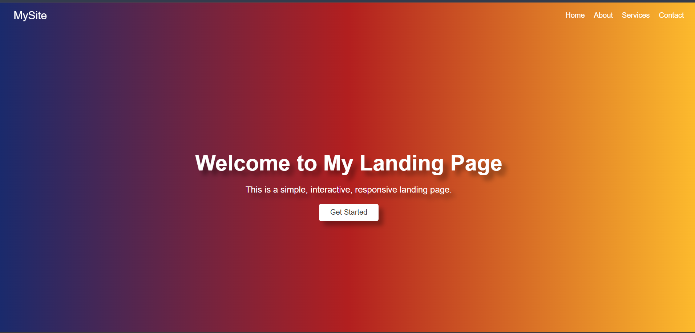
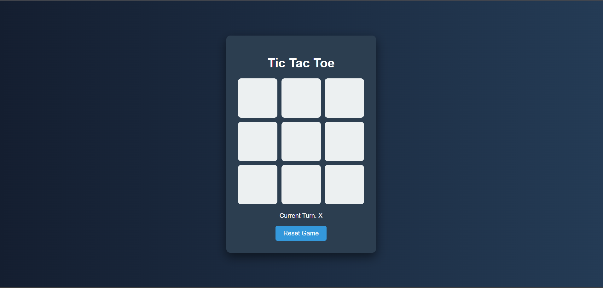
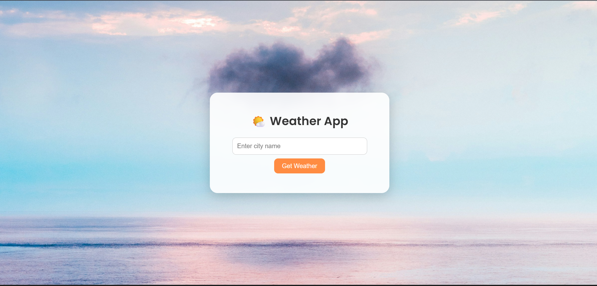

# 🌐 Prodigy Infotech Web Development Internship

This repository contains all 5 tasks completed during the **Prodigy Infotech Web Development Internship – June 2025 Batch**.  
The internship was focused on building responsive web applications using **HTML**, **CSS**, **JavaScript**, and real-time **API integration**.

---

## ✅ Tasks Completed

| Task No. | Task Name            | Description |
|----------|----------------------|-------------|
| **Task 1** | 🖥️ Landing Page      | Created a responsive landing page with modern design using HTML, CSS, and basic JavaScript. |
| **Task 2** | ⏱️ Stopwatch         | Built a stopwatch with start, stop, and reset features using JavaScript and DOM manipulation. |
| **Task 3** | ❌⭕ Tic Tac Toe Game | Developed a 2-player Tic Tac Toe game using pure HTML, CSS, and JavaScript logic. |
| **Task 4** | 👨‍💼 Portfolio        | Designed and developed a personal portfolio website to showcase skills, projects, and contact info. |
| **Task 5** | 🌤️ Weather App      | Built a weather forecasting app using the OpenWeatherMap API with sunrise gradient and cloud background. |

---

## 🛠 Technologies Used

- HTML5  
- CSS3  
- JavaScript (ES6)  
- OpenWeatherMap API  
- Google Fonts  
- Responsive Design Principles  

---

## 📁 Folder Structure

Each folder contains:
- `index.html`
- `style.css`
- `script.js`
- `README.md` (in some tasks)
- `screenshot.png` (visual preview)

---

## 💼 Internship Info

- **Company**: Prodigy Infotech  
- **Role**: Web Development Intern  
- **Duration**: June 2025  
- **Mode**: Remote  
- **Type**: Project-based Internship  

---

## 🙋‍♂️ Developer

- **Name**: Gaurav Upadhyay  
- **GitHub**: [Gullu-D](https://github.com/Gullu-D)  
- **Email**: ugaurav034@gmail.com  
- **College**: MIT ADT University, Pune  

---

## 📸 Screenshots

### Task 1 – Landing Page  

---

### Task 2 – Stopwatch  

---

### Task 3 – Tic Tac Toe  

---

### Task 4 – Portfolio  

---

### Task 5 – Weather App  

